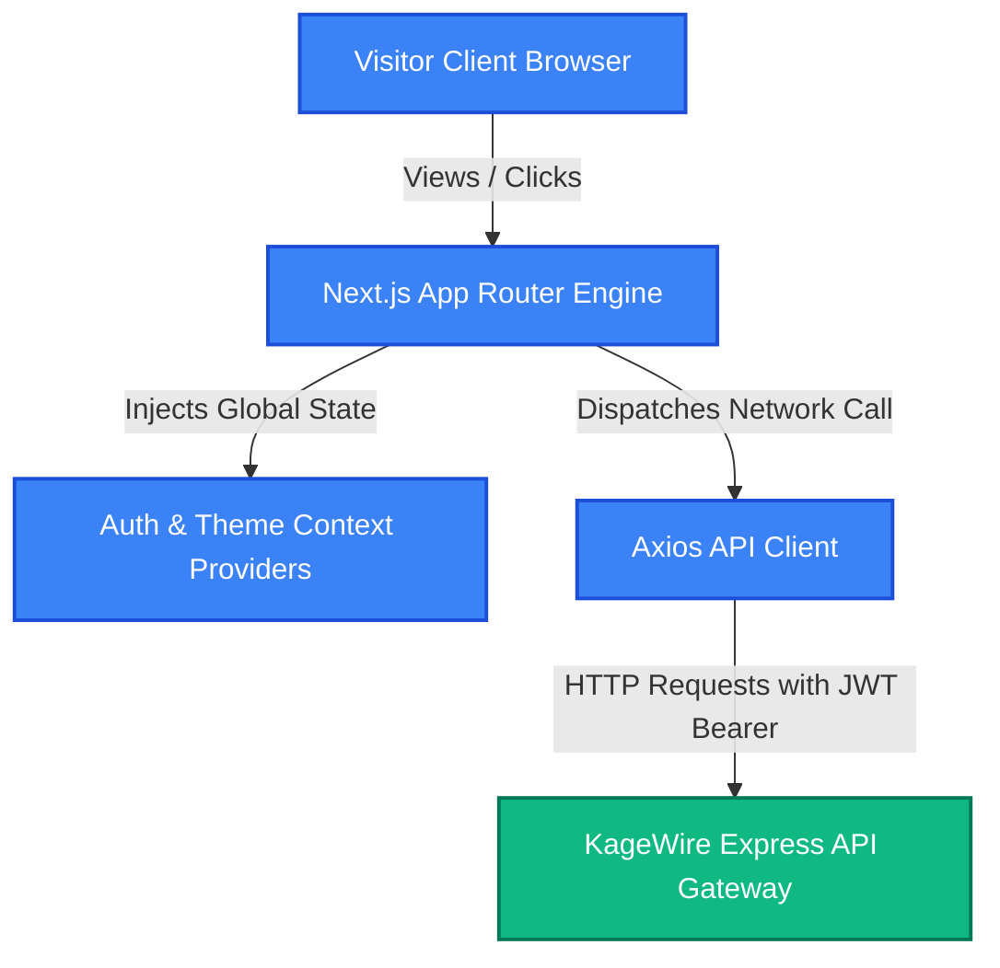

# 📐 KageWire Frontend - Architecture & Developer Guide

Frontend client application for KageWire powered by Next.js, React 19, and Tailwind CSS v4.

> [!IMPORTANT]
> **Active Development:** This client-side repository is currently under active development. Core visual components, global state providers, and API client adapters are in the blueprint planning phase.

---

## 📝 Overview

**KageWire Frontend** is an ultra-modern, high-performance, and responsive user interface built on the Next.js App Router (Turbopack) framework. It is designed to act as a visually gorgeous, reactive portal for anime discovery, watchlist tracking, and real-time news aggregation.

The client app acts as the direct consumer of the **KageWire Backend Gateway API**, providing users with a premium experience featuring fluid transitions, micro-animations, glassmorphic card designs, and instant responsiveness.

---

# 🛠️ Tech Stack

Click on each category to expand and explore the technologies powering the KageWire client application.

<details open>
  <summary><b>🟢 Framework & Core Language</b></summary>

  | Technology | Description | Status |
  | :--- | :--- | :--- |
  | **Next.js (v16)** | Next-generation React framework enabling Turbopack compiling, server components (RSC), and file-system routing. | `Ready` |
  | **React (v19)** | Industry-standard declarative UI component library featuring high-performance rendering. | `Ready` |
  | **TypeScript** | Strongly-typed JavaScript variant enabling compile-time error detection and strict contracts. | `Ready` |

</details>

<br>

<details>
  <summary><b>🎨 Styling & Visual Design</b></summary>

  | Technology | Description | Status |
  | :--- | :--- | :--- |
  | **Tailwind CSS (v4)** | Next-gen CSS-first utility framework featuring high-speed build times and container queries. | `Ready` |
  | **PostCSS** | CSS compiler wrapper enabling advanced styling parsing. | `Ready` |

</details>

<br>

<details>
  <summary><b>🔌 Network & Data Fetching</b></summary>

  | Technology | Description | Status |
  | :--- | :--- | :--- |
  | **Axios** | Promise-based HTTP client for secure asynchronous request orchestration with custom interceptors. | `🛠️ Planned` |

</details>

<br>

<details>
  <summary><b>🔒 State Management & Context</b></summary>

  | Technology | Description | Status |
  | :--- | :--- | :--- |
  | **React Context API** | Native, lightweight state sharing mechanism to manage global sessions (Auth) and UI preferences (Theme). | `🛠️ Planned` |

</details>

---

# 📦 Dependency Reference

All client packages are strictly audited to minimize bundle size and ensure fluid interface responsiveness.

<details open>
  <summary><b>🚀 Core Dependencies</b></summary>

  | Dependency | Purpose | Details & Use Case |
  | :--- | :--- | :--- |
  | `next` | React Framework | Powers the App Router routing structure, SSR, and asset compiler. |
  | `react` | UI Runtime | Library that handles component lifecycles, states, and client rendering. |
  | `react-dom` | DOM Binder | Maps React state components cleanly into actual HTML elements. |

</details>

<br>

<details>
  <summary><b>🛠️ Development Dependencies</b></summary>

  | Dependency | Purpose | Description |
  | :--- | :--- | :--- |
  | `typescript` | Compiler Service | Static typing definitions and compile-time linting support. |
  | `tailwindcss` | Utility styling | Utility classes engine for fast responsive visual scaffolding. |
  | `@tailwindcss/postcss` | Styles Builder | PostCSS builder configuration specifically for Tailwind CSS v4. |
  | `@types/*` | Static Types | Standard typings wrapper to enable type completion for React and Node. |
  | `eslint` | Quality Linter | Spot checks code quality and standardizes formatting rules. |
  | `eslint-config-next` | Next.js Rules | Injects core ESLint rules specific to Next.js page development. |

</details>

---

# 🎯 Client Roadmap

The scope of planned user interface modules and feature integrations for KageWire:

| Module / Screen | Category | Target Release | Status |
| :--- | :--- | :---: | :---: |
| **Main Anime Showcase** | Landing Page | v1.0.0 | `🔄 Planned` |
| **Interactive Search & Filters** | Discovery Screen | v1.0.0 | `🔄 Planned` |
| **Personal Watchlist Manager** | User Dashboard | v1.2.0 | `🔄 Planned` |
| **Anime Detail Showcase** | Interactive Screen | v1.1.0 | `🔄 Planned` |
| **Real-time News Feed Reader** | Information Feed | v1.0.0 | `🔄 Planned` |
| **Dynamic Login & Register Forms**| Auth Screen | v1.0.0 | `🔄 Planned` |
| **Clean Navigation Interface (Navbar)**| Common Layout | v1.0.0 | `🔄 Planned` |
| **Visual Loading States (Skeletons)**| User Experience | v1.0.0 | `🔄 Planned` |
| **Dark & Light Theme Toggle** | Personalization | v1.3.0 | `🔄 Planned` |

---

# 🌐 API Aggregation Flow

The frontend coordinates with the backend API Gateway to fetch secure databases. Below is the rendering and traffic flow:



---

# 📁 Project Directory Structure

```txt
app/
 ├── auth/                  # Route segment: /auth (Authentication views)
 │    ├── login/            # Sub-segment: /auth/login (Login page)
 │    └── register/         # Sub-segment: /auth/register (Registration page)
 ├── anime/                 # Route segment: /anime (Anime discovery pages)
 │    ├── [id]/             # Dynamic route: /anime/:id (Anime detail view)
 │    └── search/           # Sub-segment: /anime/search (Search grid view)
 ├── layout.tsx             # Root layout wrapping global Navbar and Theme Providers
 ├── page.tsx               # Root page (Welcome showcase and featured anime)
 └── globals.css            # Global typography styles and Tailwind variables
components/                 # Reusable React components
 ├── ui/                    # Primitive atomic parts (Buttons, Inputs, Badges, Cards)
 ├── common/                # Layout structures (Navbar, Footer, Sidebar)
 └── anime/                 # Domain-specific components (AnimeGrid, WatchlistButton)
context/                    # Global state hooks (AuthContext, ThemeContext)
hooks/                      # Customized React state hooks (useAuth, useAnimeQuery)
lib/                        # Third-party configurations and network wrappers
 ├── axios.ts               # Pre-configured Axios instance pointing to Backend url
 └── utils.ts               # Shared helper functions (e.g. cn class merging)
types/                      # TypeScript typings interfaces (anime.d.ts, user.d.ts)
public/                     # Static media files (SVG logos, favicons, illustrations)
```

---

# 🚀 Getting Started

Follow these structural steps to launch your local Next.js client development server.

### Prerequisites
- **Node.js** (v18 or higher recommended)
- **npm** / **pnpm** / **yarn**
- **KageWire Backend** server active on `http://localhost:3000`

### Setup Instructions

#### 1. Navigate to the Frontend directory
```bash
cd kagewire/frontend
```

#### 2. Install dependencies
```bash
npm install
```

#### 3. Setup Local Environment Variables
Create a local environment configuration file inside the `frontend` folder:
```bash
touch .env.local
```

Configure the backend connection:
```env
NEXT_PUBLIC_API_URL="http://localhost:3000/api/v1"
```

#### 4. Launch the Next.js Client
```bash
npm run dev
```

Next.js will automatically detect if port `3000` is active (occupied by the backend service) and launch the client server on:
`http://localhost:3001`

---

# 🛡️ Client Security & Best Practices

- **Cross-Site Scripting (XSS) Prevention:**
  React 19 escapes values by default. Any custom raw HTML parsing (such as XML descriptions from RSS feeds) must be strictly audited.
- **CSRF & Session Security:**
  User authentication tokens are mapped inside secure, HTTP-only cookies in coordinating network requests to prevent JavaScript token leaks.
- **Image Domain Whitelisting:**
  To serve external visual covers safely, image providers ANN, MyAnimeList, and AniList are whitelisted in `next.config.ts`:
  ```ts
  images: {
    domains: ["cdn.animenewsnetwork.com", "cdn.myanimelist.net", "images.anilist.co"],
  }
  ```

---

# ⚡ Performance Optimizations

1. **Next.js Turbopack Compiler:**
   Enables ultra-fast local compilation and instant hot module replacement (HMR) under a fraction of a second.
2. **Next.js Image Component (`next/image`):**
   Ensures automatic image resizing, serves compressed modern WebP formats, and triggers lazy loading automatically to optimize mobile performance.
3. **Core CSS Bundle Isolation:**
   Tailwind CSS v4 compiles utility classes dynamically, ensuring only the styled CSS used on the client is generated in the production bundle.
